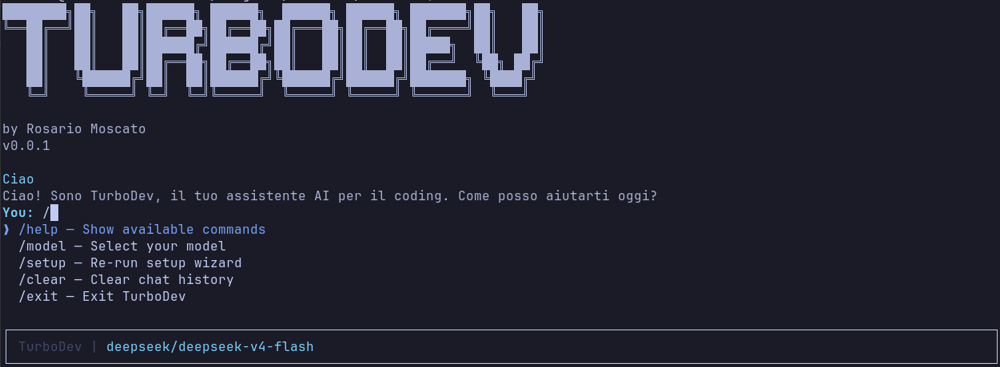

# TurboDev

**Terminal-based AI coding agent** — your coding partner in the terminal.

<p align="center">
  
</p>

## What is it

TurboDev is an AI coding agent that runs entirely in the terminal. It lets you chat with LLM models (via OpenRouter), execute tools, manage files and code — all without leaving the CLI.

## Features

- **AI Chat in the terminal** — converse with LLM models in real time with streaming
- **Model selection** — choose from dozens of popular models (DeepSeek, GPT-4, Claude, Gemini, Llama, GLM...)
- **Multi-agent system** — switch between specialized agents (editor, plan) with a single keypress, or create custom agents via Markdown
- **Permission system** — fine-grained control over what agents can do (allow, ask, deny) with bash glob patterns
- **8 built-in tools** — the AI can read, search, and edit files, run shell commands, ask questions, and invoke subagents
- **Session persistence** — conversations are saved automatically and can be resumed across restarts
- **Context window management** — real-time token tracking (`0.56K/128K`), auto-compaction at 85%, manual `/compact`
- **Real-time cost tracking** — see how much you're spending per session based on OpenRouter pricing
- **Request interruption** — press Escape to cancel a running AI request at any time
- **AGENTS.md support** — project context and instructions loaded automatically from the open standard
- **/init wizard** — generate an AGENTS.md file interactively with auto-detection of project type
- **Markdown rendering** — formatted responses with headings, lists, code blocks, and bold text in the terminal
- **Guided setup** — interactive configuration of API key and model on first launch

## Installation

```bash
# Install globally via npm
npm install -g @rosariomoscato/turbodev

# Or run directly without installing
npx @rosariomoscato/turbodev
```

### From Source

```bash
git clone https://github.com/rosariomoscato/TurboDev.git
cd TurboDev
npm install
npm run build
npm link
```

## Usage

```bash
# Launch TurboDev from anywhere
turbodev

# Guided setup
turbodev --setup
```

### Chat commands

| Command | Description |
|---------|-------------|
| `/help` | Show available commands |
| `/init` | Generate AGENTS.md with interactive wizard |
| `/model` | Select AI model |
| `/agent` | Switch agent |
| `/setup` | Re-run setup wizard |
| `/clear` | Clear chat history |
| `/compact` | Compact conversation to free context window |
| `/new` | Start a new session |
| `/sessions` | List and switch between sessions |
| `/exit` | Exit TurboDev |

### Keyboard shortcuts

| Key | Action |
|-----|--------|
| `Tab` | Switch between agents |
| `Escape` | Cancel action / Interrupt AI request |
| `@agentname` | Invoke an agent directly |

### Available tools

| Tool | Description |
|------|-------------|
| `read_file` | Read the contents of a file |
| `list_files` | List files in a directory |
| `edit_file` | Create or edit a file |
| `mkdir` | Create directories |
| `grep` | Search file contents with regex (uses ripgrep if available) |
| `bash` | Execute shell commands with timeout |
| `question` | Ask the user for clarification |
| `task` | Invoke a subagent for specialized tasks |

## Configuration

TurboDev requires an **OpenRouter API key** to work. The setup wizard will guide you through configuration on first launch, or you can launch it with `/setup`.

Configuration is saved in `~/.config/turbodev/config.json`.

## AGENTS.md

TurboDev supports the open [AGENTS.md](https://agents.md/) standard — a markdown file that provides context and instructions to the AI agent. If present in the working directory, it is automatically loaded at startup and passed as project context.

The `/init` command generates the file through an interactive wizard that:
- Auto-detects the project type (Node.js, Python, Rust, Go)
- Lets you select which sections to include (Setup Commands, Code Style, Testing, Design, etc.)
- If the file already exists, asks whether to overwrite or append new sections

## Tech Stack

- **TypeScript** — primary language
- **React + Ink** — declarative terminal UI
- **OpenRouter** — multi-model LLM provider
- **tsup** — build system

## Author

**Rosario Moscato**

## License

This work is licensed under [Creative Commons Attribution-NonCommercial-ShareAlike 4.0 International](https://creativecommons.org/licenses/by-nc-sa/4.0/).

You are free to:
- **Share** — copy and redistribute the material in any medium or format
- **Adapt** — remix, transform, and build upon the material

Under the following terms:
- **Attribution** — you must give appropriate credit to the author
- **NonCommercial** — you may not use the material for commercial purposes
- **ShareAlike** — if you remix or transform, you must distribute under the same license


