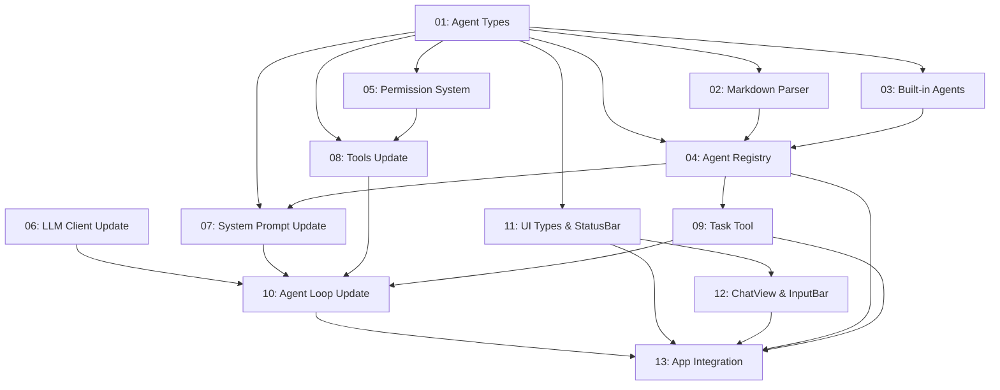

# Agent System

## Overview

Introduces a full multi-agent architecture to TurboDev, inspired by OpenCode's agent system. Agents are specialized AI assistants configurable via Markdown files with YAML frontmatter. The system ships with two built-in primary agents (editor and plan), supports custom agents via `.md` files, enforces per-agent tool permissions with approval prompts, and enables subagent invocation via a `task` tool and `@mention` syntax.

## Quick Links

- [Requirements](./requirements.md) — full requirements and acceptance criteria
- [Action Required](./action-required.md) — manual steps needing human action

## Dependency Graph

## Waves

| Wave | Tasks | Description |
|------|-------|-------------|
| 1 | task-01, task-02, task-03 | Foundation: types, Markdown parser, built-in agents |
| 2 | task-04, task-05, task-06 | Core engine: registry, permissions, LLM client |
| 3 | task-07, task-08, task-09 | Integration layer: system prompt, tools, task tool |
| 4 | task-10 | Agent loop: the central execution engine |
| 5 | task-11, task-12 | UI components: types, StatusBar, ChatView, InputBar |
| 6 | task-13 | Final wiring: App.tsx integration with switching, @mention, permissions |

## Task Status

### Wave 1
- [ ] [task-01-agent-types](./tasks/task-01-agent-types.md) — Core type definitions (AgentConfig, permissions)
- [ ] [task-02-markdown-parser](./tasks/task-02-markdown-parser.md) — Markdown frontmatter parser with gray-matter
- [ ] [task-03-builtin-agents](./tasks/task-03-builtin-agents.md) — Built-in editor and plan agents

### Wave 2
- [ ] [task-04-agent-registry](./tasks/task-04-agent-registry.md) — Agent discovery, loading, and merge
- [ ] [task-05-permission-system](./tasks/task-05-permission-system.md) — Permission resolution engine
- [ ] [task-06-llm-client-update](./tasks/task-06-llm-client-update.md) — Parameterize temperature/topP in LLM client

### Wave 3
- [ ] [task-07-system-prompt-update](./tasks/task-07-system-prompt-update.md) — Agent-aware system prompt generation
- [ ] [task-08-tools-update](./tasks/task-08-tools-update.md) — Permission-aware tool execution
- [ ] [task-09-task-tool](./tasks/task-09-task-tool.md) — Subagent invocation tool

### Wave 4
- [ ] [task-10-agent-loop-update](./tasks/task-10-agent-loop-update.md) — Agent-aware agent loop

### Wave 5
- [ ] [task-11-ui-types-statusbar](./tasks/task-11-ui-types-statusbar.md) — UI types and StatusBar update
- [ ] [task-12-chatview-inputbar](./tasks/task-12-chatview-inputbar.md) — ChatView and InputBar update

### Wave 6
- [ ] [task-13-app-integration](./tasks/task-13-app-integration.md) — Final App.tsx integration
