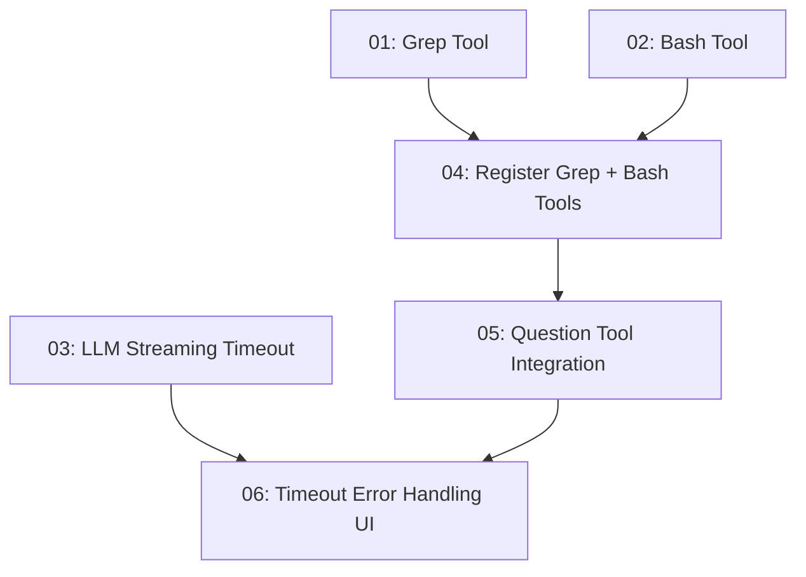

# Agent Tools & Timeout Handling

## Overview

Aggiunta di tre nuovi strumenti all'agente TurboDev (`grep`, `bash`, `question`) e gestione robusta del timeout per le chiamate LLM streaming. Questi cambiamenti trasformano TurboDev da un semplice editor di file a un agente di coding completo, capace di cercare codice, eseguire comandi, interagire con l'utente e gestire graceful i timeout.

## Quick Links

- [Requirements](./requirements.md) — requisiti completi e criteri di accettazione
- [Action Required](./action-required.md) — passi manuali necessari

## Dependency Graph

## Waves

| Wave | Tasks | Description |
|------|-------|-------------|
| 1 | task-01, task-02, task-03 | Implementazioni indipendenti: grep tool, bash tool, timeout nel client LLM |
| 2 | task-04 | Registrazione di grep e bash nel tool registry + aggiornamento system prompt |
| 3 | task-05 | Question tool: implementazione, registrazione, integrazione agent loop + UI |
| 4 | task-06 | Gestione timeout nell'agent loop + UI: error recovery, retry dell'utente |

## Task Status

### Wave 1
- [x] [task-01-grep-tool](./tasks/task-01-grep-tool.md) — Implementazione tool grep per ricerca contenuto file
- [x] [task-02-bash-tool](./tasks/task-02-bash-tool.md) — Implementazione tool bash per esecuzione comandi shell
- [x] [task-03-llm-timeout](./tasks/task-03-llm-timeout.md) — Timeout nelle chiamate LLM streaming

### Wave 2
- [x] [task-04-register-tools](./tasks/task-04-register-tools.md) — Registrazione grep + bash nel tool registry

### Wave 3
- [x] [task-05-question-tool](./tasks/task-05-question-tool.md) — Question tool: implementazione completa con UI

### Wave 4
- [x] [task-06-timeout-ui](./tasks/task-06-timeout-ui.md) — Gestione errori timeout in agent loop + UI
