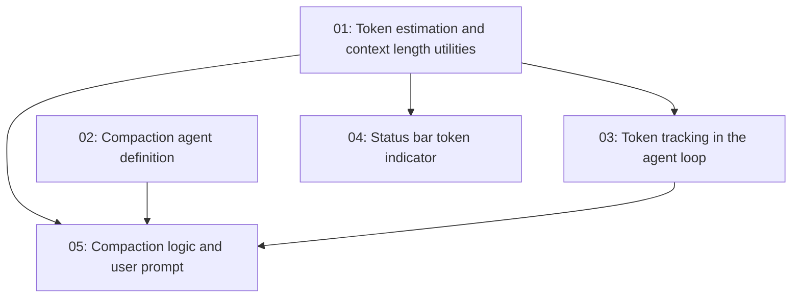

# Context Window Management

## Overview

Implement context window tracking and management for TurboDev. The system retrieves the context length of the selected model from OpenRouter, tracks token usage during conversation, shows a visual indicator in the status bar, warns the user when approaching the limit, and automatically compacts the conversation when needed.

## Quick Links

- [Requirements](./requirements.md) — full requirements and acceptance criteria
- [Action Required](./action-required.md) — manual steps needing human action

## Dependency Graph

## Waves

| Wave | Tasks | Description |
|------|-------|-------------|
| 1 | task-01, task-02 | Foundation: token utilities and compaction agent definition |
| 2 | task-03, task-04 | Integration: token tracking in the loop + status bar display |
| 3 | task-05 | Orchestration: compaction prompt and execution logic in App.tsx |

## Task Status

### Wave 1
- [x] [task-01-token-utilities](./tasks/task-01-token-utilities.md) — Token estimation and context length caching
- [x] [task-02-compaction-agent](./tasks/task-02-compaction-agent.md) — Compaction agent definition in builtins

### Wave 2
- [x] [task-03-loop-tracking](./tasks/task-03-loop-tracking.md) — Token tracking in the agent loop
- [x] [task-04-status-bar](./tasks/task-04-status-bar.md) — Status bar token usage indicator

### Wave 3
- [x] [task-05-compaction-logic](./tasks/task-05-compaction-logic.md) — Compaction logic and user prompt
