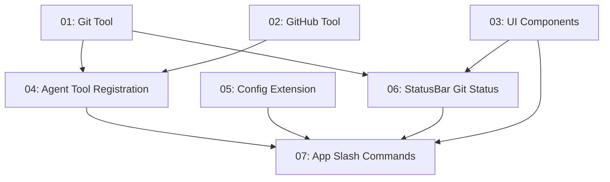

# Git/GitHub Integration

## Overview

Add dedicated Git and GitHub tool integration to TurboDev, enabling users and the AI agent to perform Git operations (commit, push, branch, rollback, etc.) and GitHub operations (PRs, issues, reviews) from within the terminal-based AI coding agent. Includes slash commands for direct user access, a GitHub auth wizard, and git status in the StatusBar.

## Quick Links

- [Requirements](./requirements.md) — full requirements and acceptance criteria
- [Action Required](./action-required.md) — manual steps needing human action

## Dependency Graph

## Waves

| Wave | Tasks | Description |
|------|-------|-------------|
| 1 | task-01, task-02, task-03 | Create standalone tool and UI files (git tool, github tool, UI components) |
| 2 | task-04, task-05, task-06 | Wire tools into agent system, extend config, update StatusBar |
| 3 | task-07 | Add slash commands and full integration in App.tsx |

## Task Status

### Wave 1
- [x] [task-01-git-tool](./tasks/task-01-git-tool.md) — Create Git tool with simple-git
- [x] [task-02-github-tool](./tasks/task-02-github-tool.md) — Create GitHub tool wrapping gh CLI
- [x] [task-03-ui-components](./tasks/task-03-ui-components.md) — Create GithubAuthWizard and GitStatus components

### Wave 2
- [x] [task-04-agent-registration](./tasks/task-04-agent-registration.md) — Register git/github tools in agent system
- [x] [task-05-config-extension](./tasks/task-05-config-extension.md) — Extend config store for GitHub auth
- [x] [task-06-statusbar-git](./tasks/task-06-statusbar-git.md) — Add git branch/dirty indicator to StatusBar

### Wave 3
- [x] [task-07-slash-commands](./tasks/task-07-slash-commands.md) — Add slash commands and full App.tsx integration
