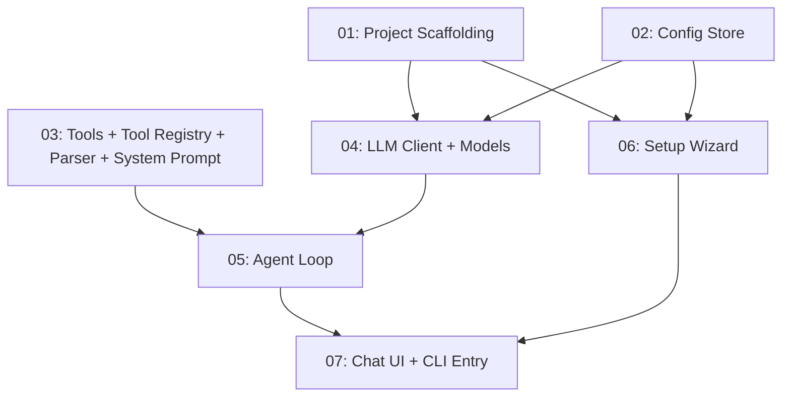

# TurboDev CLI

## Overview

TurboDev is a terminal-based AI coding agent CLI tool, installable globally via npm. It provides a minimal but powerful coding experience where users chat with an AI that can read files, list directories, and edit/create files. Built with ink + React for a polished TUI experience, using OpenRouter for AI inference with streaming support.

## Quick Links

- [Requirements](./requirements.md) — full requirements and acceptance criteria
- [Action Required](./action-required.md) — manual steps needing human action

## Dependency Graph

## Waves

| Wave | Tasks | Description |
|------|-------|-------------|
| 1 | task-01, task-02, task-03 | Project scaffolding, config management, and core tool infrastructure (parallel) |
| 2 | task-04 | LLM client with OpenRouter streaming and model fetching |
| 3 | task-05, task-06 | Agent loop (tool execution integration) and SetupWizard UI (parallel) |
| 4 | task-07 | Chat UI components (ChatView, InputBar, StatusBar) and CLI entry point integration |

## Task Status

### Wave 1
- [x] [task-01-project-scaffolding](./tasks/task-01-project-scaffolding.md) — Set up npm project, TypeScript config, build pipeline
- [x] [task-02-config-store](./tasks/task-02-config-store.md) — Config read/write for ~/.turbodevrc
- [x] [task-03-tools](./tasks/task-03-tools.md) — Three core tools (read_file, list_files, edit_file), tool registry, parser, system prompt

### Wave 2
- [x] [task-04-llm-client](./tasks/task-04-llm-client.md) — OpenRouter client with streaming and model fetcher

### Wave 3
- [x] [task-05-agent-loop](./tasks/task-05-agent-loop.md) — Core agent loop with streaming and tool execution
- [x] [task-06-setup-wizard](./tasks/task-06-setup-wizard.md) — First-run setup wizard for API key and model selection

### Wave 4
- [x] [task-07-chat-ui](./tasks/task-07-chat-ui.md) — Chat UI (ChatView, InputBar, StatusBar) and CLI entry point with command handling